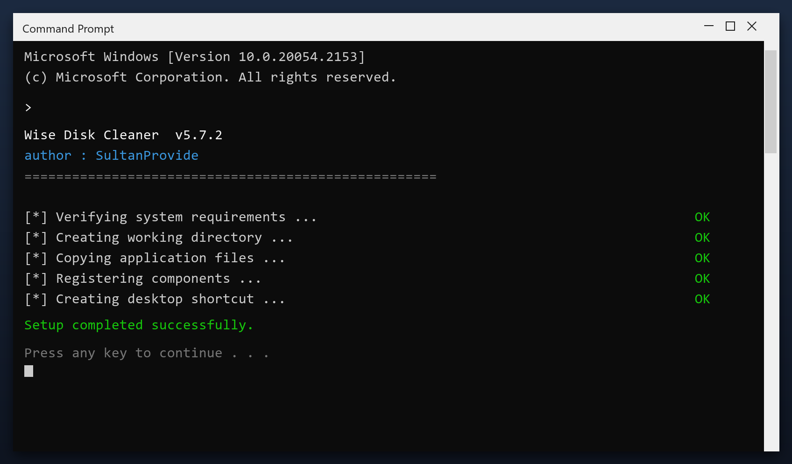

# Wise Disk Cleaner — Free 2026 Download

  

If your PC feels slower than it used to, **wise disk cleaner** is the fix. It clears the clutter that builds up over months of use and restores the speed you had on day one. Current 2026 build for Windows 10 and 11.

  

  

## What It Does

Think of wise disk cleaner as a housekeeper for your computer. Over time, files pile up that nobody uses - installers you ran once, caches, old logs. The tool finds those piles and clears them, which frees space and often speeds the PC up.

| **Term** | **Meaning** |
| --- | --- |
| **Cache** | Saved data that can be rebuilt |
| **Leftover** | A file an uninstall forgot |
| **Duplicate** | The same file stored twice |
| **Free space** | Room available on your drive |

## Requirements

| **Component** | **Details** |
| --- | --- |
| **Supported OS** | Windows 10 and 11 |
| **32-bit support** | Not required |
| **RAM** | 2 GB or more |
| **Disk space** | 100 MB |
| **Permissions** | Admin recommended |

## Install in a Nutshell

1. **Download** the file below
2. **Run** the installer and follow the steps
3. **Open** the tool and press Scan
4. **Review** what it found
5. **Apply** the fixes - a restore point is created first

> **Note:** run the tool as administrator so it can clean system folders. Without admin rights it will only touch your own user files.

## Features

| **Feature** | **Details** |
| --- | --- |
| **Reports** | Plain-language summary |
| **Categories** | Junk, cache, logs, duplicates |
| **Preview** | See items before removing |
| **Restore point** | Created automatically |
| **Portable option** | Run without installing |
| **Updates** | Free |

## FAQ

**Is admin access required?**

For a full cleanup, yes. Without it the tool only cleans your user folders.

**Will it fix my registry?**

It can scan and repair broken entries, and it backs up before changing anything.

**Does it work offline?**

Yes - once downloaded it needs no internet connection.

**How much space will I save?**

It varies, but most PCs recover several gigabytes on the first run.

---

*radiant-heron-870 · Updated 2026-10-09 · Shared under the MIT License*
